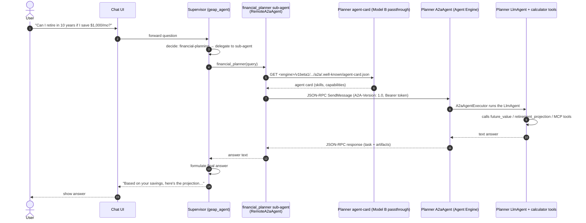
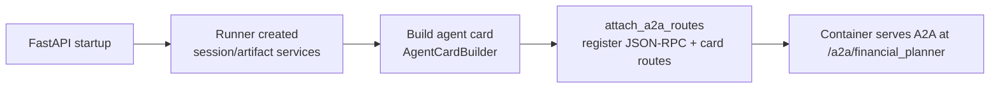
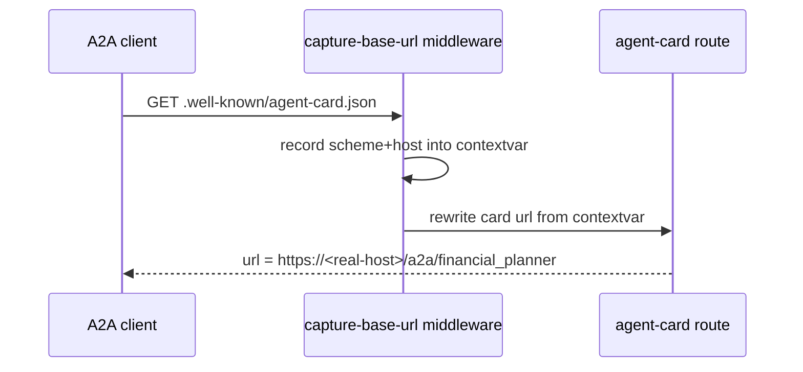
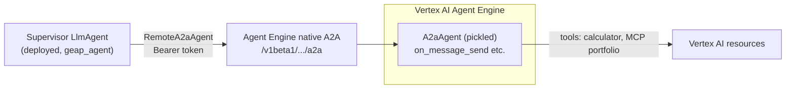
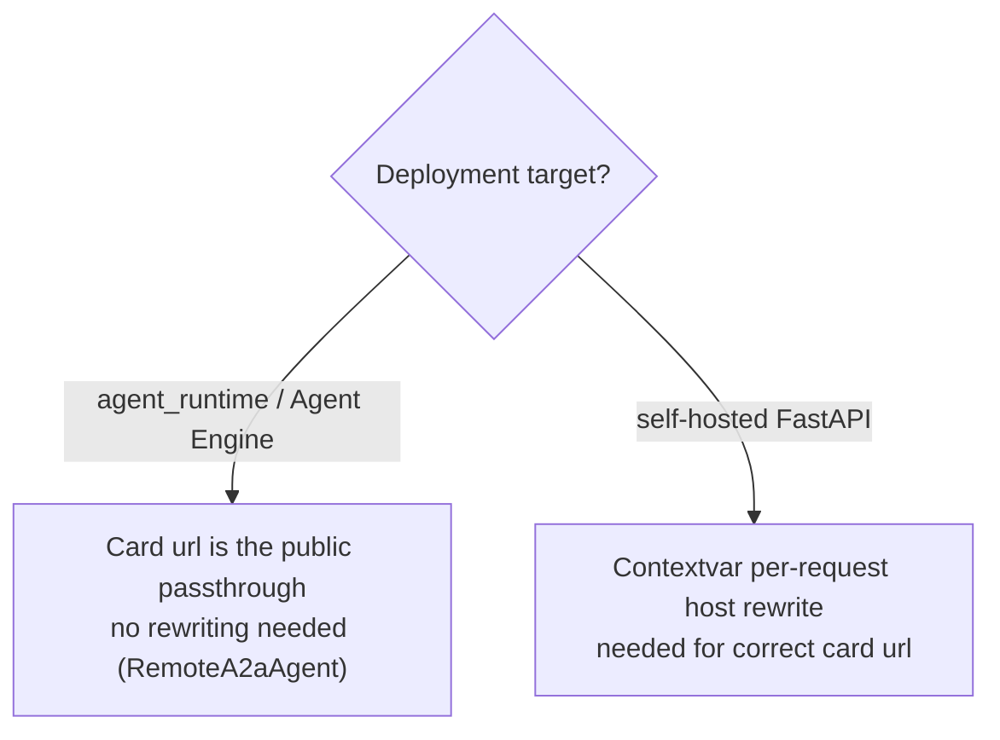
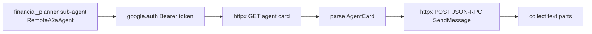
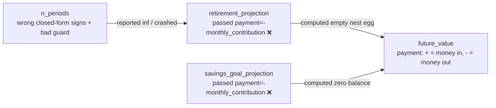
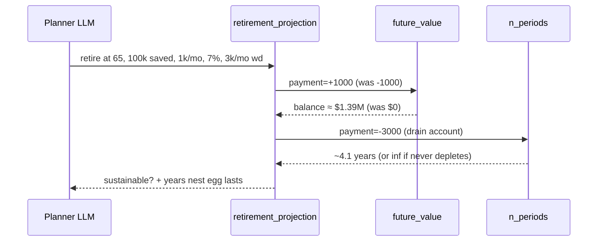

# A2A Architecture — Financial Planner & Supervisor

This document explains how the **Financial Planner** agent (this repo) and the
**GEAP supervisor** (`geap_agent`) communicate, and how that behaves under the
two deployment models we care about: **self-hosted FastAPI** (Cloud Run / GKE)
and **Vertex AI Agent Engine / Agent Runtime**.

> New to A2A? Start with [A2A_GUIDE_FOR_BEGINNERS.md](./A2A_GUIDE_FOR_BEGINNERS.md),
> a first-principles walkthrough of the protocol and the end-to-end flow.
> Hitting an issue? See [TROUBLESHOOTING.md](./TROUBLESHOOTING.md) for every
> error encountered and resolved during deployment.
> Want rich agent-driven UI in the chat? See [A2UI_TUTORIAL.md](./A2UI_TUTORIAL.md).

---

## 1. The end-to-end A2A flow

The user talks to the **supervisor**, which delegates financial-planning
questions to the **planner** over the Agent2Agent (A2A) protocol.



### Key protocol details

- The A2A **method is `SendMessage`** (camelCase, gRPC-style) — the legacy
  `message/send` draft name returns `-32601 Method not found`.
- Requests must carry an **`A2A-Version: 1.0`** header; otherwise the server
  returns `-32009 A2A version not supported`.
- A2A messages use the **protobuf enum role `ROLE_USER`** (not the string
  `user`), and require a `message_id`.
- The planner's A2A routes are registered in a FastAPI `lifespan` hook:



---

## 2. Deployment model A — Self-hosted FastAPI (Cloud Run / GKE)

Here the planner runs as a plain HTTP service. A2A clients fetch the agent card
over HTTP and use the **`url` embedded in the card** to send JSON-RPC.

```mermaid
flowchart LR
    subgraph Client["Supervisor (a2a-sdk client in call_financial_planner)"]
        A[Fetch agent-card.json]
        B[POST SendMessage to card url]
    end
    subgraph Server["Planner (FastAPI service)"]
        C[.well-known/agent-card.json route]
        D[/a2a/financial_planner JSON-RPC route]
    end
    A --> C
    B --> D
```

### Why the URL matters here

The card advertises `url = "<app_url>/a2a/financial_planner"`. If `app_url`
defaults to `http://0.0.0.0:8000`, the client tries to reach a non-routable
address.

**Fix (applied in this repo):** the card URL is derived per-request from the
actual `Host` header via a middleware + contextvar, with `APP_URL` taking
precedence.



> The supervisor's `geap_agent/app/app_utils/a2a.py` still has the hardcoded
> `http://0.0.0.0:8000` default. Port the same fix **only if** you run the
> supervisor self-hosted.

---

## 3. Deployment model B — Vertex AI Agent Engine / Agent Runtime (current)

The planner is deployed to **Vertex AI Agent Engine as an `A2aAgent` (Model B)**
via `app/deploy_a2a.py` (`ReasoningEngine.create()` with the
`vertexai.agent_engines.templates.a2a.A2aAgent` wrapper). Agent Engine hosts the
agent card natively and proxies the container's `/a2a/financial_planner` routes
publicly at:

```
https://<location>-aiplatform.googleapis.com/v1beta1/
  projects/<project>/locations/<location>/reasoningEngines/<id>/a2a
```

The card is fetched at `.../a2a/.well-known/agent-card.json`, and the JSON-RPC
base is `.../a2a`.



Key facts — verified against the deployed planner (2026-08):

- The **`A2aAgent` template** serves the A2A protocol natively (JSON-RPC over
  the platform passthrough), and the engine's agent card is hosted at
  `.../a2a/.well-known/agent-card.json`.
- The supervisor's `financial_planner` sub-agent is an ADK
  **`RemoteA2aAgent`** (`geap_agent/app/agents/financial_planner_agent.py`) that
  fetches the card lazily with an authenticated `httpx` client and sends JSON-RPC
  through it — no URL rewriting needed, because the card's advertised URL is the
  public passthrough.
- **Auth** is a Google OAuth Bearer token from ambient credentials
  (`google.auth.default()`), scoped to cloud-platform.
- The card is publicly fetchable through the passthrough (no
  `handle_authenticated_agent_card()` needed for this deployment path).

### Known issue: A2A operation registration with current SDK versions

`google-cloud-aiplatform`'s `ReasoningEngine.create()` registers the
`A2aAgent`'s `on_*` methods by generating a pydantic schema for each. The
a2a-sdk request types (`SendMessageRequest`, `GetTaskRequest`, ...) are
**protobuf messages**, and the gRPC `ServerCallContext` is opaque, so schema
generation fails and the engine deploys with **zero registered operations**
(the card 404s). `app/deploy_a2a.py` works around this in
`_make_a2a_operations_registrable()`: it resolves the methods' string
annotations to the real protobuf classes, attaches
`__get_pydantic_core_schema__` (emitting an unconstrained core schema), and maps
anything else to `object`. Revisit when aiplatform supports protobuf-typed A2A
methods natively.

### Implication for the contextvar fix



**Bottom line:** the contextvar change in this repo is correct and harmless for
Agent Engine (the passthrough card is what clients consume), and *necessary*
for the self-hosted path. On the supervisor side, `RemoteA2aAgent` uses the
card's advertised URL directly — the Model B passthrough card is already
public.

---

## 4. The supervisor's client — `RemoteA2aAgent` (current design)

The supervisor consumes the planner through ADK's **`RemoteA2aAgent`**
(`geap_agent/app/agents/financial_planner_agent.py`), wired as the
`financial_planner` sub-agent. It:

- takes the planner's agent-card URL (`FINANCIAL_PLANNER_URL`) and resolves the
  card lazily on first use;
- authenticates with a Bearer token from ambient credentials
  (`google.auth.default()`) via its `httpx_client`;
- sends JSON-RPC `SendMessage` through the card's advertised URL — which, for
  a Model B deployment, is the public passthrough base, so **no URL rewriting
  is needed**.



The planner is stateless by design: `full_history_when_stateless=True` keeps
follow-up planning questions independent.

> **Historical note:** an earlier design used a custom `call_financial_planner`
> `FunctionTool` with the a2a-sdk client + passthrough URL rewrite
> (`app/tools/a2a_planner_tool.py`, since deleted). It was replaced because
> `RemoteA2aAgent` is the ADK-native way to delegate to a remote A2A agent and
> matches the Model B passthrough (whose card URL needs no rewriting). The
> a2a-sdk client remains the right tool if you ever need finer control over the
> A2A conversation (streaming, task lifecycle).

---

## 5. Planning calculator — sign-convention bug

While reviewing the flow we also found and fixed a correctness bug in
`app/tools/planning_calculator.py`.



### What changed

- **Fixed sign convention** — `retirement_projection` and
  `savings_goal_projection` now pass `payment=monthly_contribution` (positive =
  money in), matching `future_value`.
- **Fixed `n_periods` formula** — corrected the closed-form NPER signs and the
  "unreachable goal" guard; withdrawals now deplete correctly.
- **Guarded `ValueError`** — an unsustainable (never-depleting) scenario now
  reports `inf` instead of crashing the tool call.



---

## 6. Quick reference

| Concern | Self-hosted FastAPI | Agent Engine / Agent Runtime (Model B) |
|---|---|---|
| A2A transport | HTTP JSON-RPC `SendMessage` | HTTP JSON-RPC via native passthrough (`/v1beta1/.../a2a`) |
| Agent card | Served at `/.well-known/agent-card.json` | Passthrough card at `.../a2a/.well-known/agent-card.json` |
| Card URL source | Embedded in card at startup | Passthrough URL is already public — no rewrite needed |
| Auth | None (add middleware) | Bearer token from ambient credentials |
| Serving surface | Your FastAPI app | Agent Engine hosts the `A2aAgent` natively |
| Client (supervisor) | a2a-sdk client | ADK `RemoteA2aAgent` sub-agent |
