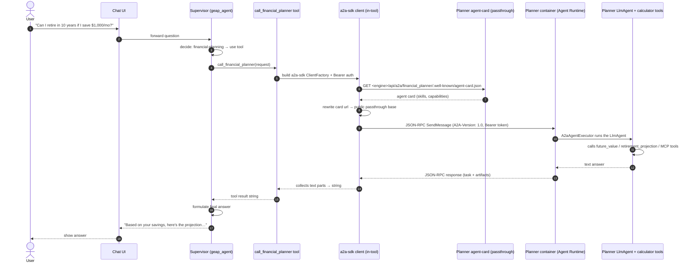
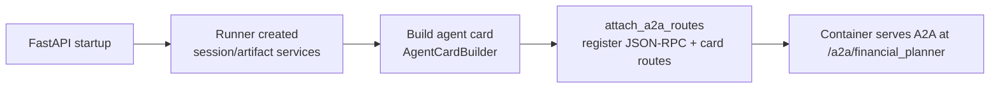
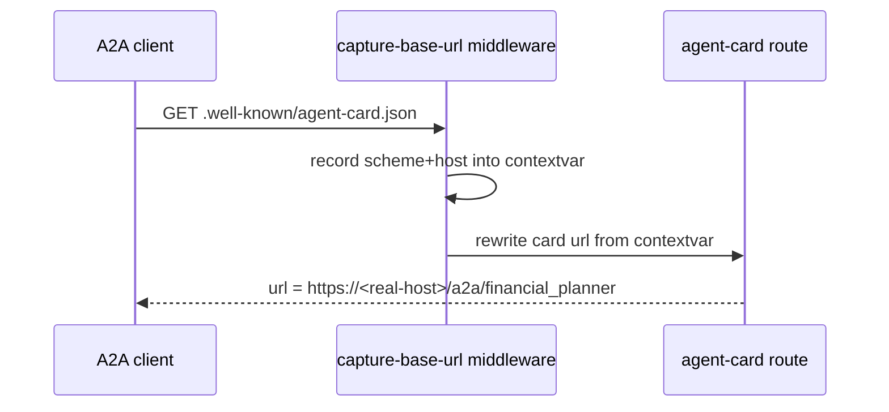
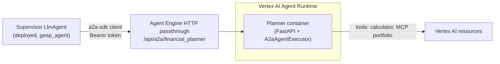
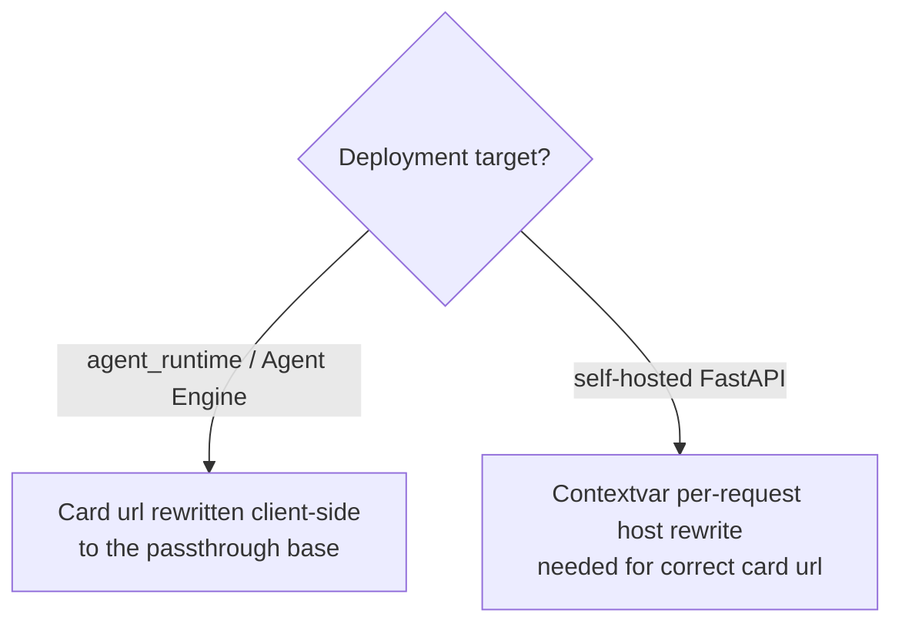
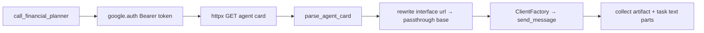
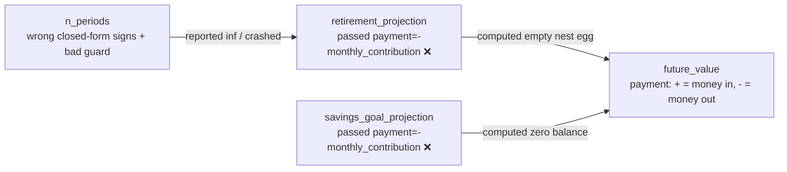
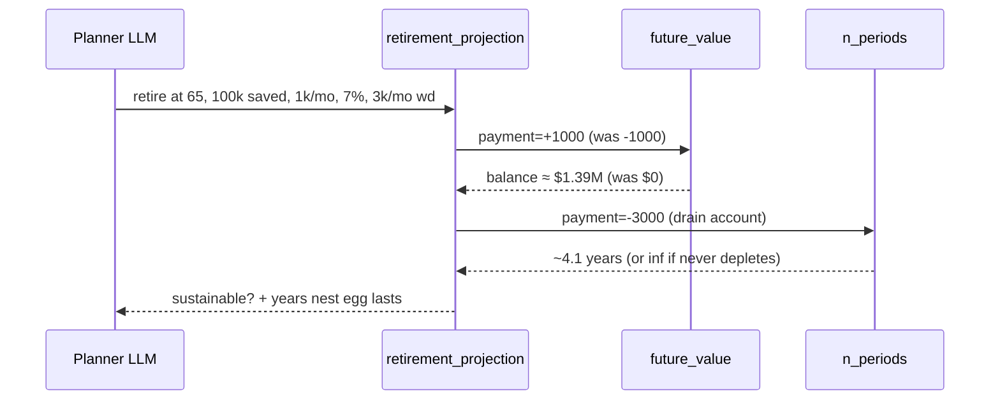

# A2A Architecture — Financial Planner & Supervisor

This document explains how the **Financial Planner** agent (this repo) and the
**GEAP supervisor** (`geap_agent`) communicate, and how that behaves under the
two deployment models we care about: **self-hosted FastAPI** (Cloud Run / GKE)
and **Vertex AI Agent Engine / Agent Runtime**.

> New to A2A? Start with [A2A_GUIDE_FOR_BEGINNERS.md](./A2A_GUIDE_FOR_BEGINNERS.md),
> a first-principles walkthrough of the protocol and the end-to-end flow.
> Hitting an issue? See [TROUBLESHOOTING.md](./TROUBLESHOOTING.md) for every
> error encountered and resolved during deployment.
> Want rich agent-driven UI in the chat? See [A2UI_TUTORIAL.md](./A2UI_TUTORIAL.md).

---

## 1. The end-to-end A2A flow

The user talks to the **supervisor**, which delegates financial-planning
questions to the **planner** over the Agent2Agent (A2A) protocol.



### Key protocol details

- The A2A **method is `SendMessage`** (camelCase, gRPC-style) — the legacy
  `message/send` draft name returns `-32601 Method not found`.
- Requests must carry an **`A2A-Version: 1.0`** header; otherwise the server
  returns `-32009 A2A version not supported`.
- A2A messages use the **protobuf enum role `ROLE_USER`** (not the string
  `user`), and require a `message_id`.
- The planner's A2A routes are registered in a FastAPI `lifespan` hook:



---

## 2. Deployment model A — Self-hosted FastAPI (Cloud Run / GKE)

Here the planner runs as a plain HTTP service. A2A clients fetch the agent card
over HTTP and use the **`url` embedded in the card** to send JSON-RPC.

```mermaid
flowchart LR
    subgraph Client["Supervisor (a2a-sdk client in call_financial_planner)"]
        A[Fetch agent-card.json]
        B[POST SendMessage to card url]
    end
    subgraph Server["Planner (FastAPI service)"]
        C[.well-known/agent-card.json route]
        D[/a2a/financial_planner JSON-RPC route]
    end
    A --> C
    B --> D
```

### Why the URL matters here

The card advertises `url = "<app_url>/a2a/financial_planner"`. If `app_url`
defaults to `http://0.0.0.0:8000`, the client tries to reach a non-routable
address.

**Fix (applied in this repo):** the card URL is derived per-request from the
actual `Host` header via a middleware + contextvar, with `APP_URL` taking
precedence.



> The supervisor's `geap_agent/app/app_utils/a2a.py` still has the hardcoded
> `http://0.0.0.0:8000` default. Port the same fix **only if** you run the
> supervisor self-hosted.

---

## 3. Deployment model B — Vertex AI Agent Engine / Agent Runtime

When both agents are deployed with `deployment_target: agent_runtime`, the
planner's container serves A2A routes internally (`/a2a/financial_planner`),
and **Agent Engine exposes them publicly over its HTTP passthrough** at:

```
https://<location>-aiplatform.googleapis.com/reasoningEngines/v1/
  projects/<project>/locations/<location>/reasoningEngines/<id>/
  api/a2a/financial_planner/.well-known/agent-card.json
```

The JSON-RPC base is the same path without the card suffix
(`.../api/a2a/financial_planner`).



Key facts — verified against the deployed planner (2026-08):

- The **container** serves the A2A card and JSON-RPC at `/a2a/financial_planner`
  (your FastAPI `attach_a2a_routes` code — unchanged between self-hosted and
  Agent Runtime).
- **Agent Engine proxies that path publicly** under
  `.../reasoningEngines/v1/{resource}/api/a2a/<agent_directory>`. The
  `agent_directory` is `app` (the manifest value), and the route under it is
  the container's `rpc_path` (`financial_planner`).
- **The card advertises the container's internal URL**
  (`http://reasoning-engine-<id>-<hash>-<region>.a.run.app/...`), which is not
  directly reachable. Clients must **rewrite the card's interface URL to the
  public passthrough base** — the supervisor's `call_financial_planner` tool
  does this.
- **Auth** is a Google OAuth Bearer token from ambient credentials
  (`google.auth.default()`), scoped to cloud-platform.
- The card is publicly fetchable through the passthrough (no
  `handle_authenticated_agent_card()` needed for this deployment path).

### Implication for the contextvar fix



**Bottom line:** the contextvar change in this repo is correct and harmless for
Agent Engine (the passthrough card is what clients consume), and *necessary*
for the self-hosted path. On the supervisor side, the client-side URL rewrite
in `a2a_planner_tool.py` is what makes the Agent Runtime card usable.

---

## 4. The supervisor's client — from `RemoteA2aAgent` to the a2a-sdk client

The original design used ADK's `RemoteA2aAgent` (an ADK agent wrapper that does
HTTP card fetch + JSON-RPC through an internal runner). That approach cannot
reach an Agent Engine passthrough because:

- It performs **unauthenticated** HTTP card fetch and JSON-RPC — the passthrough
  requires a Bearer token.
- It uses the card's advertised URL verbatim — which is the container's
  **internal** URL, not reachable from the supervisor.

The current `app/tools/a2a_planner_tool.py` therefore uses the **a2a-sdk
client** directly:



It is still wrapped as an ADK `FunctionTool`, so the supervisor LLM calls it
exactly as before.

---

## 5. Planning calculator — sign-convention bug

While reviewing the flow we also found and fixed a correctness bug in
`app/tools/planning_calculator.py`.



### What changed

- **Fixed sign convention** — `retirement_projection` and
  `savings_goal_projection` now pass `payment=monthly_contribution` (positive =
  money in), matching `future_value`.
- **Fixed `n_periods` formula** — corrected the closed-form NPER signs and the
  "unreachable goal" guard; withdrawals now deplete correctly.
- **Guarded `ValueError`** — an unsustainable (never-depleting) scenario now
  reports `inf` instead of crashing the tool call.



---

## 6. Quick reference

| Concern | Self-hosted FastAPI | Agent Engine / Agent Runtime |
|---|---|---|
| A2A transport | HTTP JSON-RPC `SendMessage` | HTTP JSON-RPC via passthrough (`/api/a2a/...`) |
| Agent card | Served at `/.well-known/agent-card.json` | Passthrough card at `.../api/a2a/<dir>/.well-known/agent-card.json` |
| Card URL source | Embedded in card at startup | Passthrough URL; card's internal url must be rewritten client-side |
| Auth | None (add middleware) | Bearer token from ambient credentials |
| Serving surface | Your FastAPI app | Platform proxies your FastAPI container |
| Client (supervisor) | a2a-sdk client | a2a-sdk client + passthrough URL rewrite |
