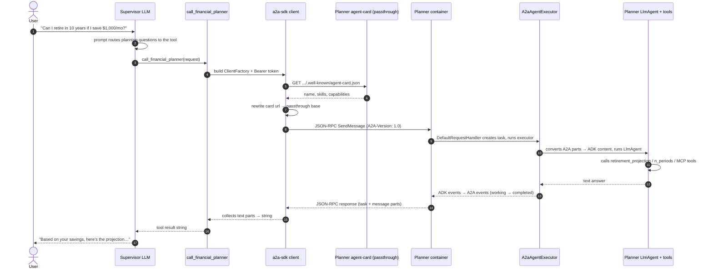
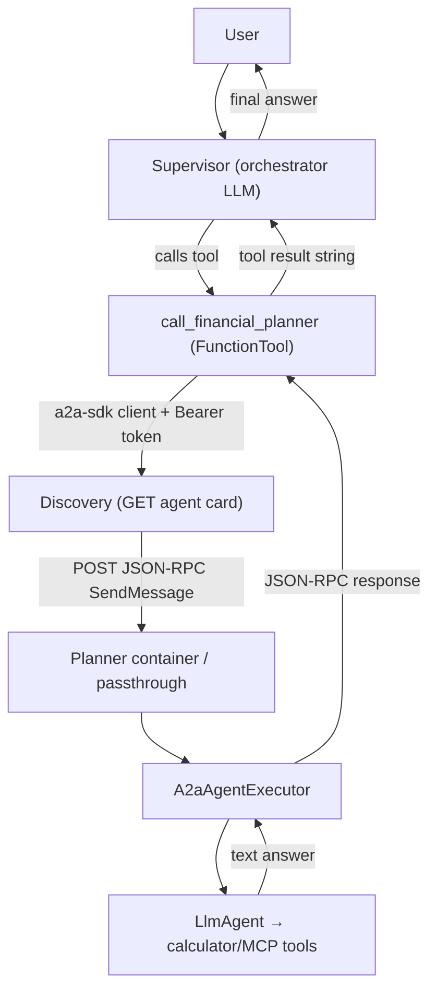

# A2A from First Principles — A Beginner's Guide

A walkthrough of how the **GEAP supervisor** (`geap_agent`) talks to the
**Financial Planner** (this repo) using the **A2A (Agent2Agent)** protocol.
Read this before the [A2A_ARCHITECTURE.md](./A2A_ARCHITECTURE.md) deep dive.

---

## 1. What is A2A, really?

A2A is Google's open protocol for letting **one agent call another agent as if
it were a service**. Think of it as "HTTP + JSON for agents".

- **Transport** — plain HTTPS POST requests with JSON bodies. No special
  networking; works across clouds and companies.
- **Message format** — **JSON-RPC 2.0**, the same style of protocol as calling
  a remote function (`SendMessage`, `GetTask`, `CancelTask`).
- **Discovery** — every A2A agent publishes an **agent card**: a JSON file that
  works like an API's OpenAPI spec. It says "here's my name, here's my JSON-RPC
  endpoint URL, here's what I can do" (its *skills*).
- **Unit of work** — a **task**. Each message you send becomes a task with an
  id, a status (`working` → `completed` / `failed`), and a stream of events.

> Nothing more magical than that: find another agent's card, send it a
> message over HTTP, get an answer back.

---

## 2. The two roles in this system

```mermaid
flowchart LR
    subgraph ClientSide["Supervisor side (geap_agent)"]
        LLM["Supervisor LLM (orchestrator)"]
        Tool["call_financial_planner (FunctionTool)"]
        Cli["a2a-sdk client<br/>(in-tool, Bearer auth)"]
    end
    subgraph Wire["A2A wire (HTTPS + JSON-RPC)"]
        Card["GET agent-card.json<br/>discovery"]
        RPC["POST .../api/a2a/financial_planner<br/>SendMessage"]
    end
    subgraph ServerSide["Planner side (this repo)"]
        FastAPI["FastAPI container<br/>DefaultRequestHandler"]
        Exec["A2aAgentExecutor"]
        PlannerAgent["Financial planner LlmAgent<br/>Gemini + calculator tools + MCP"]
    end

    LLM -->|"decides: planning question"| Tool
    Tool -->|"builds a2a-sdk client"| Cli
    Cli --> Card
    Card --> RPC
    RPC --> FastAPI
    FastAPI --> Exec
    Exec --> PlannerAgent
```



**Client side — the supervisor (`geap_agent`)**

- Exposes a `call_financial_planner` tool — a normal ADK `FunctionTool`.
- Inside the tool, uses the **a2a-sdk client** (`ClientFactory` +
  `send_message`) to talk A2A directly — no ADK agent wrapper involved.
- Authenticates with a **Google Bearer token** from the ambient credentials
  (`google.auth.default()`), which the Agent Engine passthrough requires.
- Knows where the planner lives via `FINANCIAL_PLANNER_URL`, which points at
  the planner's agent-card URL on the Agent Engine passthrough.

**Server side — the planner (this repo)**

- A FastAPI container that wires up A2A routes at startup
  (`attach_a2a_routes` in `app/app_utils/a2a.py`).
- Exposes two relevant endpoints (served both directly and, when deployed to
  Agent Runtime, through the platform's HTTP passthrough):

| Endpoint | Method | Purpose |
|---|---|---|
| `/a2a/financial_planner/.well-known/agent-card.json` | GET | The agent card (discovery) |
| `/a2a/financial_planner` | POST | The JSON-RPC endpoint (needs an `A2A-Version: 1.0` header) |

- Internally bridges incoming A2A calls to ADK's `Runner` via
  `A2aAgentExecutor`, which runs the actual `financial_planner` `LlmAgent`
  (Gemini + 6 calculator tools + optional MCP portfolio tools).

---

## 3. The flow, end to end

Example: the user asks the chat *"Can I retire in 10 years if I save $1,000/month?"*



---

## 4. Step by step

### Step 1 — The supervisor decides to delegate
The user's question enters the supervisor LLM. Its prompt routes
financial-planning questions to the `call_financial_planner` tool, so the LLM
calls it with the question as the argument.

### Step 2 — The tool builds an A2A client
```python
headers = _auth_headers()  # Bearer token from google.auth
card = await fetch_agent_card()  # httpx GET of FINANCIAL_PLANNER_URL
# The card advertises the container's internal URL — rewrite it to the
# public Agent Engine passthrough base before sending.
for interface in card.supported_interfaces:
    interface.url = rpc_base
client = ClientFactory(ClientConfig(...)).create(card)
```
The tool talks A2A directly through the a2a-sdk client — no `RemoteA2aAgent`,
no internal ADK runner. Each call uses a fresh `message_id`, so the planner
stays stateless.

### Step 3 — Client fetches the agent card
The tool does an HTTP GET on `FINANCIAL_PLANNER_URL` with the Bearer token.
The card returns: name `financial_planner`, capabilities, and one *skill* per
tool (`financial_planner-retirement_projection`, etc.). This is the "how do I
talk to you" discovery step.

### Step 4 — JSON-RPC round trip
The client POSTs a JSON-RPC `SendMessage` (with `A2A-Version: 1.0` and the
Bearer token) to the passthrough base. On the server, `DefaultRequestHandler`
creates a task, and `A2aAgentExecutor` converts the A2A message into a Gemini
`Content(role="user", ...)`.

### Step 5 — The planner does its job
The planner's LLM picks the calculator tools to call — for "Can I retire in 10
years with $1,000/month?" that's likely `retirement_projection` or
`n_periods` — and, if `MCP_PORTFOLIO_URL` is set, the remote MCP portfolio
tools too. It produces a text answer.

### Step 6 — The response converts back
ADK run events become A2A events (`working` → `completed`, plus a final `Task`
with the message parts), carried back in the JSON-RPC response. (If the client
had asked for streaming via `SendStreamingMessage`, the server would reply with
a Server-Sent Events stream instead.)

### Step 7 — Tool result → supervisor answer
The tool collects the text parts from the task's artifacts and history, joins
them, and returns a plain string — that string is the tool result the
supervisor LLM sees, and it phrases the final answer to the user.

---

## 5. The mental model



Things worth internalizing:

- **A2A is just HTTP + JSON-RPC + a discovery card.** Everything between the
  a2a-sdk client (supervisor side) and `DefaultRequestHandler` (planner side)
  is standard wire protocol, so either side could be any framework — not just
  ADK.
- **The conversion layers** (ADK content ↔ A2A message parts) exist because ADK
  has its own internal message model, separate from the A2A spec. That's what
  the `convert_genai_part_to_a2a_part` warnings are about.
- **The planner is stateless by design** — each call gets a fresh task, so
  follow-up questions start clean (no planner-side memory between calls).
- **Deployment note:** on Vertex AI Agent Runtime, Agent Engine proxies the
  container's `/a2a/financial_planner` routes publicly under
  `.../api/a2a/<agent_dir>` — but the card advertises the container's internal
  URL, so the client must rewrite it to the passthrough base. The supervisor's
  tool does this automatically.

---

## 6. Where to go next

- [A2A_ARCHITECTURE.md](./A2A_ARCHITECTURE.md) — the deep dive: deployment
  models, protocol edge cases, and the calculator sign-convention fix.
- [TROUBLESHOOTING.md](./TROUBLESHOOTING.md) — every error hit and resolved
  during deployment, explained from first principles.
- `app/app_utils/a2a.py` — the planner's server-side A2A wiring
  (`attach_a2a_routes`, agent-card builder, URL-rewrite middleware).
- `app/fast_api_app.py` — where A2A routes are attached at startup.
- `geap_agent/app/tools/a2a_planner_tool.py` — the supervisor's client-side
  tool (a2a-sdk client + passthrough URL rewrite).
