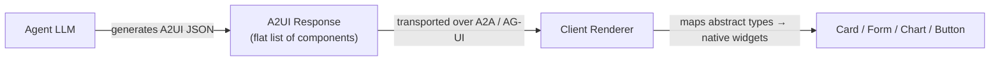

# A2UI Tutorial — Rich Agent-Driven UI for GEAP

How to make your **GEAP agents speak UI**, not just text — using **A2UI
(Agent-to-User Interface)**, the open standard from the [A2UI project](https://github.com/a2ui-project/a2ui).

This tutorial is written for the GEAP stack you have working today:

- **Planner** (`akapal-geap-financial-planner`) — ADK `LlmAgent`, A2A via FastAPI/Agent Runtime
- **Supervisor** (`akapal-geap-agent`) — ADK `LlmAgent`, calls the planner over A2A
- **Frontend** (`akapal-geap-ui`) — framework-free Node/Express SPA with a chat panel

---

## 1. What A2UI is (and why it matters here)

A2UI is the protocol that lets an agent send **declarative UI descriptions**
instead of plain text. From the [official README](https://github.com/a2ui-project/a2ui):

> *"Agents send a declarative JSON format describing the **intent** of the UI.
> The client application then renders this using its own native component
> library. This ensures agent-generated UIs are **safe like data, but
> expressive like code**."*

**Status:** early-stage public preview — **v0.9.1** is the current stable
release; v1.0 is a release candidate; v0.8 is legacy. Expect changes.

### The core idea, in one diagram



The agent describes *what* UI it wants (`type: "card"`, `properties: {...}`);
the client decides *how* to render it. The agent can **only** use components
from a **catalog** the client trusts — so no arbitrary code runs.

### Why this fits GEAP

Your UI already does the "text + sentinel hack" version of this. In
`akapal-geap-ui/server.js`:

```js
const WIDGET_SIGNAL_TOOLS = { show_rebalance_widget: "REBALANCE_FORM" };
// ... scans the event stream for a functionCall and injects "[[WIDGET:REBALANCE_FORM]]"
```

That's a hand-rolled, single-purpose way to say "show a widget." A2UI
generalizes it: the agent emits structured components (cards, forms, charts)
with data, and your frontend renders them — with validation, incremental
updates, and a security boundary.

---

## 2. How A2UI works (the protocol)

### The A2UI Response format

An agent emits a **flat list of components**, each with an `id` and `type`,
plus `properties` (data) and optionally `actions` (events). Example:

```json
{
  "ui": [
    {
      "id": "retirement-card",
      "type": "card",
      "properties": {
        "title": "Retirement Projection",
        "content": "At $1,000/mo and 7% returns, you reach $180k in 10 years."
      },
      "actions": [
        {
          "id": "open-details",
          "type": "button",
          "properties": { "label": "See breakdown" }
        }
      ]
    }
  ]
}
```

### Transport over A2A

When carried over A2A, the A2UI JSON is wrapped in **`<a2ui:open>` /
`<a2ui:close>` tags** and converted to a **`DataPart`** on the wire. The agent
card advertises an **A2UI extension** so clients know it can speak A2UI:

```python
from a2ui.a2a.extension import get_a2ui_agent_extension

AgentCapabilities(
    streaming=True,
    extensions=[
        get_a2ui_agent_extension(
            version, accepts_inline_catalogs, supported_catalog_ids
        )
    ],
)
```

### Client events (v0.9)

The client can send user actions *back* to the agent as `DataPart`s carrying
an `"action"` payload — e.g. a `book_restaurant` button click with a context
object. The agent's executor reads it and continues the conversation.

---

## 3. The ADK agent pattern (from the official samples)

The [restaurant_finder ADK sample](https://github.com/a2ui-project/a2ui/tree/main/samples/agent/adk/restaurant_finder)
is the canonical template. The architecture:

```
A2A Server
  ├─ AgentCard          (advertises A2UI extension + skills)
  ├─ AgentExecutor      (a2a AgentExecutor — routes A2A parts, reads client events)
  └─ RestaurantAgent    (wraps TWO ADK runners: text-only + UI-capable)
       ├─ DirectJsonFormat + BasicCatalog  (schema + examples for the LLM)
       ├─ parse_response / stream_response_to_parts  (tags → DataParts)
       └─ jsonschema validation + retry loop
```

Key pieces, simplified:

```python
# 1. An inference format couples the LLM prompt to the A2UI schema
inference_format = DirectJsonFormat(
    version="0.9",
    catalogs=[BasicCatalog.get_config(version="0.9", examples_path="examples/0.9")],
    schema_modifiers=[remove_strict_validation],
)

# 2. Build TWO agents: one for text, one that emits A2UI
text_agent = LlmAgent(model=..., instruction=get_text_prompt(), tools=[...])
ui_agent = LlmAgent(
    model=..., instruction=inference_format.generate_system_prompt(...), tools=[...]
)

# 3. On each request, pick based on whether the client asked for the A2UI extension
if active_ui_version:
    runner = ui_runner
else:
    runner = text_runner

# 4. Stream the LLM output, parsing A2UI JSON out of the token stream
async for part in stream_response_to_parts(parser, token_stream(), version=ui_version):
    yield {"is_task_complete": False, "parts": [part]}

# 5. Validate the final response against the catalog schema; retry if invalid
response_parts = parse_response(final_response_content)
for part in response_parts:
    if part.a2ui_json:
        selected_catalog.validator.validate(part.a2ui_json)
```

The custom-components example shows the extension points: an **inline catalog**
(`inline_catalog_0.9.json`) defines your own components, and a **"Smart
Wrapper"** connects a custom component (even an iframe sandbox) to A2UI's data
binding and event system.

---

## 4. How to use A2UI in YOUR project — three integration options

Your stack is special: the planner and supervisor are already serving over A2A,
and the frontend is a plain-JS SPA. A2UI slots in at different layers depending
on how far you want to go.

### Option A — Render A2UI parts in the existing chat (frontend-only, lowest effort)

If the **supervisor/planner** can be taught to emit A2UI-tagged JSON inside
their text, your Node server just needs a renderer.

1. **Teach the planner** to wrap UI JSON in `<a2ui:open>...</a2ui:close>` in
   its answer (prompt-level change, no new deps):
   ```python
   PLANNER_PROMPT = """...
   When the user asks for a projection, respond with a text summary AND an
   A2UI card:
   <a2ui:open>
   {"ui":[{"id":"proj","type":"card","properties":{...}}]}
   </a2ui:close>
   """
   ```
2. **Parse it in `server.js`** where you already stream deltas:
   ```js
   // reuse your createIncrementalGeapEventParser(); then scan for a2ui tags
   const match = text.match(/<a2ui:open>([\s\S]*?)<\/a2ui:close>/);
   if (match) {
     const ui = JSON.parse(match[1]);
     res.write(`data: ${JSON.stringify({ ui })}\n\n`);  // send structured UI to the browser
   }
   ```
3. **Render in `js/chat.js`** — map `type: "card"` to your existing card DOM,
   `type: "table"` to a holdings table, etc. (a mini catalog of your own).

This gets you A2UI-shaped payloads with **zero new Python dependencies** and
no redeploy of the agents — just prompt + frontend changes.

### Option B — Full A2UI on the planner (ADK `a2ui` library, A2A transport)

Adopt the real A2UI SDK on the planner side, matching the official samples:

1. Add `a2ui` to the planner's `pyproject.toml` (`pip install a2ui`).
2. Wrap the planner agent in the A2UI pattern:
   - a `DirectJsonFormat` with a `BasicCatalog` (or your own inline catalog
     with GEAP components: `projection-card`, `holdings-table`,
     `goal-form`, ...)
   - a **custom `AgentExecutor`** (like `RestaurantAgentExecutor`) that picks
     the UI runner when the A2UI extension is active and reads client `action`
     parts (e.g. a `submit_goal` form)
   - validation + retry loop so the LLM always emits schema-valid UI
3. Serve it through your existing `attach_a2a_routes` / A2aAgentExecutor path
   (the executor is what `A2aAgentExecutor` wraps).
4. Frontend: implement a real **A2UI renderer** (component catalog + action
   dispatch) in `js/`. There are reference renderers in the samples
   (Lit/React/Angular); for your framework-free SPA you'd write a small
   `js/a2ui-renderer.js`.

This is the "proper" path — schema validation, incremental updates, client
events — but it's a real chunk of work on both the agent and the frontend.

### Option C — Supervisor orchestrates remote A2UI sub-agents

A2UI's "Remote Sub-Agents" use case: the **supervisor** calls the planner (as
it does today via A2A), and the planner returns an A2UI payload that the
supervisor relays into its own response. Your architecture already has the
A2A leg; the missing piece is the A2UI part conversion on both ends and the
renderer on the client. This composes with Option B (planner emits A2UI) and
Option A (frontend renders it).

---

## 5. A concrete worked example — "Projection card"

Let's make the retirement flow produce a real UI card.

### Agent side (planner prompt + tool output)

Have the planner's `retirement_projection` tool return JSON, and teach the
prompt to wrap it:

```
You have a retirement_projection result. Render it as an A2UI card:
<a2ui:open>
{"ui":[{"id":"proj-card","type":"card","properties":{
  "title":"Retirement Readiness",
  "rows":[
    {"label":"Balance at 65","value":"$1.39M"},
    {"label":"Monthly withdrawal","value":"$3,000"},
    {"label":"Nest egg lasts","value":"4.1 years"}
  ]
}}]}
</a2ui:close>
```

### Server side (`akapal-geap-ui/server.js`)

```js
// inside /api/geap/query, after parsing events, before res.end():
function extractA2Ui(events) {
  const text = events.map(e => e.content?.parts?.map(p => p.text).join("")).join("");
  const m = text.match(/<a2ui:open>([\s\S]*?)<\/a2ui:close>/);
  return m ? JSON.parse(m[1]) : null;
}
const ui = extractA2Ui(allEvents);
res.write(`data: ${JSON.stringify({ done: true, widget: widgetSentinel, ui })}\n\n`);
```

### Client side (`js/chat.js`)

```js
// a minimal A2UI renderer — your own "catalog"
function renderA2Ui(ui) {
  for (const comp of ui.ui) {
    if (comp.type === "card") {
      const el = document.createElement("div");
      el.className = "a2ui-card";
      el.innerHTML = `<h4>${comp.properties.title}</h4>` +
        comp.properties.rows.map(r => `<div>${r.label}: <b>${r.value}</b></div>`).join("");
      chatPanel.appendChild(el);
    }
  }
}
```

---

## 6. Security notes (important)

From the official samples' disclaimer — treat **all agent output as untrusted**:

- **Prompt injection:** a remote agent's card/skills/messages could contain
  crafted text; don't interpolate it into prompts without sanitization.
- **XSS:** A2UI `properties` are data. **Never** `innerHTML` them directly —
  build DOM via `createElement`/`textContent` (as in the example above) or
  escape everything.
- **DoS:** a malicious agent could emit huge/recursive layouts — cap component
  counts and depth.
- **Embedded content:** if you support iframes/webviews (the custom-components
  sample's `McpAppsCustomComponent`), sandbox them strictly.

A2UI's design helps (declarative, catalog-only, no code) — but the renderer is
your boundary.

---

## 7. Roadmap / status for your planning

| Concern | Status |
|---|---|
| A2UI spec | v0.9.1 stable; v1.0 RC; v0.8 legacy |
| Python `a2ui` SDK + ADK samples | ✅ official, mature enough to copy |
| Renderers | Web (Lit/React/Angular) + Flutter (GenUI); **no vanilla-JS official renderer** — you'd write a small one |
| Transports | A2A + AG-UI |
| Docs / samples | [a2ui.org quickstart](https://a2ui.org/quickstart/), [GitHub samples](https://github.com/a2ui-project/a2ui/tree/main/samples) |

---

## 8. Recommended next steps

1. **Try Option A first** (prompt + `server.js` + `chat.js` mini-renderer) —
   you'll see A2UI-shaped payloads in the browser within an hour, with no new
   Python deps or agent redeploys.
2. **If it works**, graduate to **Option B** on the planner: add the `a2ui`
   SDK, an inline catalog for GEAP components, schema validation + retry, and
   a proper `js/a2ui-renderer.js`.
3. **Decide the transport later**: because A2UI rides on A2A, your existing
   supervisor↔planner A2A link already carries it — no new plumbing needed.

---

## References

- [A2UI GitHub](https://github.com/a2ui-project/a2ui) — spec, samples, SDK
- [ADK restaurant_finder sample](https://github.com/a2ui-project/a2ui/tree/main/samples/agent/adk/restaurant_finder)
- [ADK custom-components sample](https://github.com/a2ui-project/a2ui/tree/main/samples/agent/adk/custom-components-example)
- [A2UI Quickstart](https://a2ui.org/quickstart/) — full-stack demo
- [AG-UI guide](https://docs.copilotkit.ai/generative-ui/a2ui) — any-framework harness
